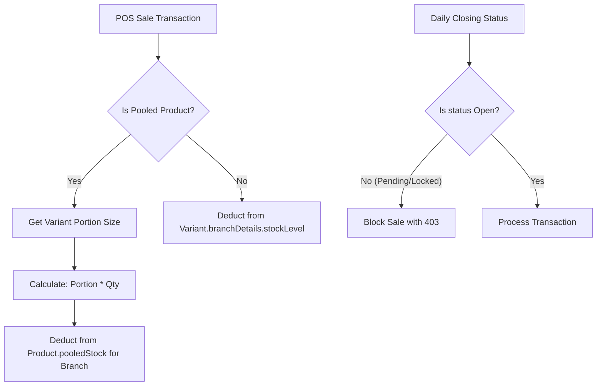

# Last Commit Analysis

**Commit Hash:** `207a0ba1bf58d269aa3dbc77e3003c2d7f6c4251`  
**Author:** adnanul-islam-jisun <adnanulislam22@gmail.com>  
**Date:** Tue Jun 30 23:23:51 2026 +0600  
**Message:** `feat: implement pooled inventory support for shared product stock across branches and update API schemas and environment configuration.`

---

## 🚀 Key Features Added

### 1. Pooled Inventory Support (Shared Stock)
A major feature added to support products whose stock is shared across all variants at a branch level (e.g., raw milk shared across 1L, 500ml, and 250ml variants).
* **Pool Mode flag (`isPooled`)**: Added to products. When true, the product's variants do not track individual stock levels. Instead, stock is drawn from a single unified "pool tank" at the branch level.
* **Portion Size (`portionSize`)**: Added to variants. When a pooled product variant is sold, it deducts `portionSize * quantity` from the branch's pool tank.
* **Pool Stock Management**: Stock can be managed directly on the pool tank using the variant ID `__pool__`. Buying prices and stock quantities are tracked at the branch level under the product's `pooledStock` array.

### 2. Day Status Gate (Manual "Start Day" Flow)
Prevents sales from taking place before the daily cash drawer is opened, enforcing better financial tracking.
* **Status Enum**: Expanded `DailyClosing.status` to `['Pending', 'Open', 'Locked']` (default is now `Pending`).
* **Day-Status Checking**: A GET request to `/api/daily-closing` returns `status: 'Pending'` if no record exists, without auto-writing a new document to the database.
* **Manual Day Start**: Cashiers must click a **"দিন শুরু করুন" (Start Day)** button on the POS Terminal. Doing so makes a PATCH request to open the day, carry over yesterday's closing cash to set `openingCash`, and compute system totals.
* **Sales Block**: Sales transactions are blocked with a `403 Forbidden` response if the day's status is `Pending` or `Locked`.

### 3. Volume Metrics in Daily Summary
Added fields to log the total volume of goods sold and procured daily, separated by their unit types:
* `liquidSold` & `weightSold` (Sales volume)
* `liquidProcured` & `weightProcured` (Procurement volume)

### 4. Sensitive Data Masking for Cashiers
Updated security stripping logic (`stripSensitiveProductData`) to remove `buyingPrice` from `pooledStock` entries when fetched by cashiers or managers (non-admins) to avoid exposing profit margins.

---

## 🛠️ Architecture & Flow Overview

---

## 📂 File-by-File Details

Here is the exact breakdown of what was modified, where the updates are, and why:

### 1. Database Schema & API Validation

* **[Product.ts](file:///Users/adnan/Projects/goowali-pos/models/Product.ts)**
  * Added `portionSize: number` (default 0) to `VariantSchema`.
  * Added `isPooled: boolean` (default false) and `pooledStock` array schema (contains `branchId`, `stockQty`, `buyingPrice`) to `ProductSchema`.
  * Added index on `pooledStock.branchId`.

* **[validators.ts](file:///Users/adnan/Projects/goowali-pos/lib/validators.ts)**
  * Added validation rules for `portionSize` in `VariantSchema`.
  * Created `PooledStockEntrySchema` (validates `branchId`, `stockQty`, `buyingPrice`).
  * Updated `ProductCreateSchema` to accept `isPooled` and `pooledStock`.

* **[DailyClosing.ts](file:///Users/adnan/Projects/goowali-pos/models/DailyClosing.ts)**
  * Default status changed from `Open` to `Pending`.
  * The status enum now includes `'Pending' | 'Open' | 'Locked'`.

* **[DailySummary.ts](file:///Users/adnan/Projects/goowali-pos/models/DailySummary.ts)**
  * Added volume summary fields: `liquidSold`, `weightSold`, `liquidProcured`, and `weightProcured` to track physical movement of stock.

---

### 2. Backend Routes (API Actions)

* **[app/api/products/[id]/route.ts](file:///Users/adnan/Projects/goowali-pos/app/api/products/[id]/route.ts)**
  * **PATCH**: Now supports receiving and updating `portionSize` during variant creation/updates.
  * **PUT**: Handled a new flag `setPooledStock: true` to update the product's pool stock details. When updating variant pricing details for a pooled product, `stockLevel` changes are ignored (pool tank remains the source of truth).

* **[app/api/transactions/route.ts](file:///Users/adnan/Projects/goowali-pos/app/api/transactions/route.ts)**
  * **Day-Status check**: Checks the day status of the branch. Aborts and returns a `403` error if day is `Pending` or `Locked`.
  * **Deduction logic**: If the product is pooled, it calculates the volume using `portionSize * quantity`, verifies sufficient stock in the pool tank, computes COGS using the pool's buying price, and deducts the total portion from the pool stock.

* **[app/api/stock-log/route.ts](file:///Users/adnan/Projects/goowali-pos/app/api/stock-log/route.ts)**
  * Supports using `__pool__` as a special `variantId` for pooled products to log stock addition/modification, create procurement transactions, and write stock logs to database.

* **[app/api/daily-closing/route.ts](file:///Users/adnan/Projects/goowali-pos/app/api/daily-closing/route.ts)**
  * **GET**: Returns `status: 'Pending'` instead of auto-creating an active day when no record is found in DB.
  * **PATCH**: Implements `{ action: 'startDay' }` to open the daily log, fetch yesterday's drawer cash as `openingCash`, compute initial system totals, and save the day as `Open`.

---

### 3. Frontend Components (User Interface)

* **[POSTerminal.tsx](file:///Users/adnan/Projects/goowali-pos/components/pos/POSTerminal.tsx)**
  * Added checks for `dayStatus`. Displays full-screen overlays blocking interaction if the status is:
    * `pending`: Shows a **"দিন শুরু করুন" (Start Day)** panel displaying yesterday's closing cash and a prominent start button.
    * `locked`: Displays an **"আজকের হিসাব বন্ধ" (Day Closed)** message.
  * Displays a "Pool" badge on pooled products.
  * Displays a variant selection overlay modal (`selectedProduct` state) when a product has multiple variants, resolving stock checking based on the pool tank if applicable.

* **[StockManager.tsx](file:///Users/adnan/Projects/goowali-pos/components/pos/StockManager.tsx)**
  * Implemented specific styling (amber-bordered card with a "Pool" badge) for pooled products.
  * Adding stock to a pooled product targets `__pool__` as the variant, directly modifying the shared tank's stock.

* **[ZReport.tsx](file:///Users/adnan/Projects/goowali-pos/components/pos/ZReport.tsx)**
  * Blocks page access with a friendly "দিন শুরু হয়নি" (Day not started) warning if the status is pending.
  * Collapses variants of a pooled product into a single virtual "মোট পরিমাণ" (Total Volume) row for physical stock verification and tomorrow's supplier orders.

* **[ProductManager.tsx](file:///Users/adnan/Projects/goowali-pos/components/admin/ProductManager.tsx)** *(Admin)*
  * Admin can toggles "Pool Mode" on products during creation.
  * Admin can set `Portion Size` when configuring variants of pooled products.
  * Added a `Set Selling Price` / `Set Branch Stock` action which warns the admin that stock for pool products is managed via the pool tank.
  * Added `PooledStockModal` allowing admins to directly seed or override branch pool stock and buying prices from the catalog.

* **[BranchReport.tsx](file:///Users/adnan/Projects/goowali-pos/components/admin/BranchReport.tsx)** *(Admin)*
  * Shows a banner "Day has not been started yet" / "No record for this date" if dayClosing is pending.
  * Displays stock check counts and reasons mapped to the virtual "pooled" items instead of printing individual variants.

---

### 4. Utilities and Core Files

* **[utils.ts](file:///Users/adnan/Projects/goowali-pos/lib/utils.ts)**
  * Masks `buyingPrice` inside the `pooledStock` array to ensure financial information is restricted to authorized roles.

* **[types/index.ts](file:///Users/adnan/Projects/goowali-pos/types/index.ts)**
  * Updated types to match the database schemas (e.g., `DayStatus` now allows `'Pending' | 'Open' | 'Locked'`, added `portionSize`, `isPooled`, `pooledStock` to type interfaces).
